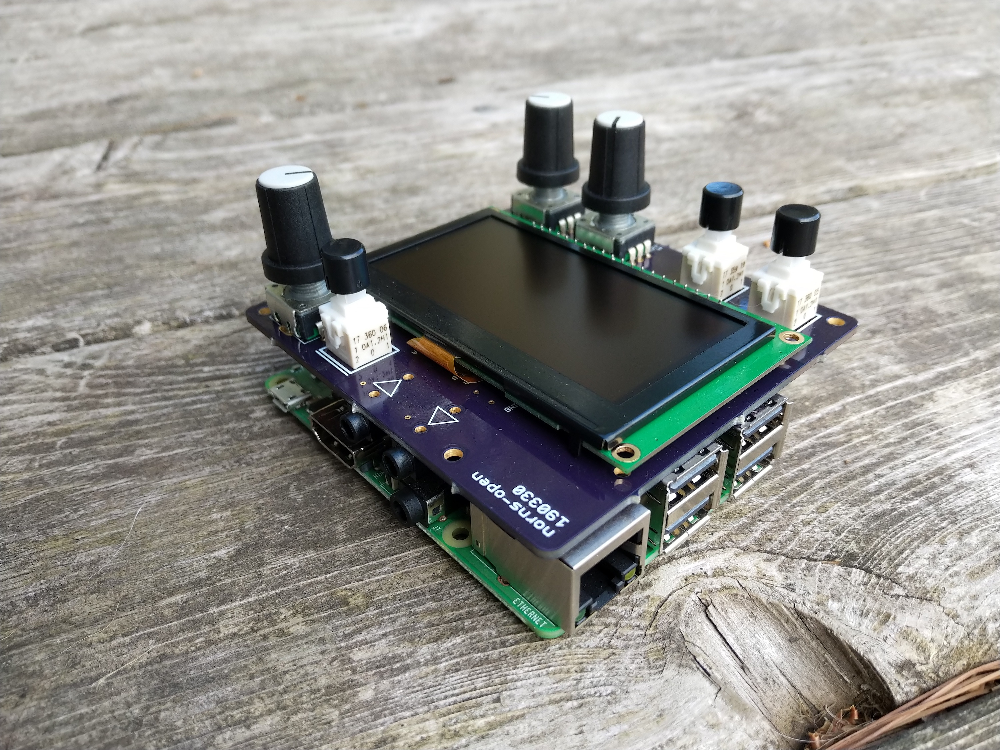
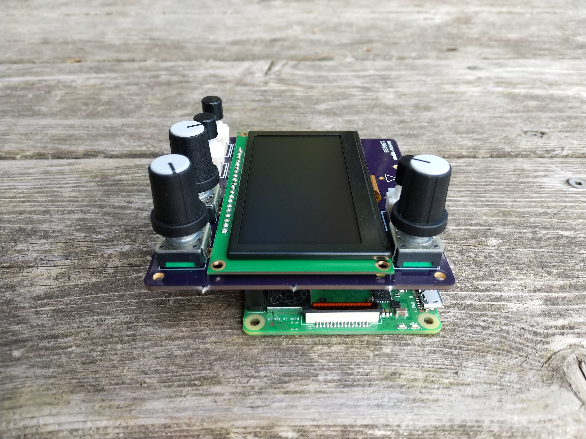

# norns-shield

_*BETA: we're close to proving this PCB, but we do not recommend you build one of these quite yet*_

minimal/tiny open-source/DIY shield for Raspberry Pi boards, providing hardware compatibility with the [norns](monome.org/norns) ecosystem.

- audio codec: CS4720
- audio jacks: 3.5mm stereo in/out, line level
- OLED: NHD-2.7-12864WDW3
- 3x pushbuttons, 3x rotary encoders

see the full [BOM on Octopart](https://octopart.com/bom-tool/Q3rQej3x)

compatible disk image forthcoming.

[monome.org](monome.org)

