# norns-shield

minimal/tiny open-source/DIY shield for Raspberry Pi boards, providing hardware compatibility with the [norns](monome.org/norns) ecosystem.

- audio codec: CS4720
- audio jacks: 3.5mm stereo in/out, line level
- OLED: NHD-2.7-12864WDW3
- 3x pushbuttons, 3x rotary encoders

see the full [BOM on Octopart](https://octopart.com/bom-tool/Q3rQej3x)

see [https://llllllll.co/t/diy-norns-shield](https://llllllll.co/t/diy-norns-shield/27638) for discussion.

[monome.org](https://monome.org)

full kit and SMD-populated PCB available from [monome.org](https://market.monome.org)

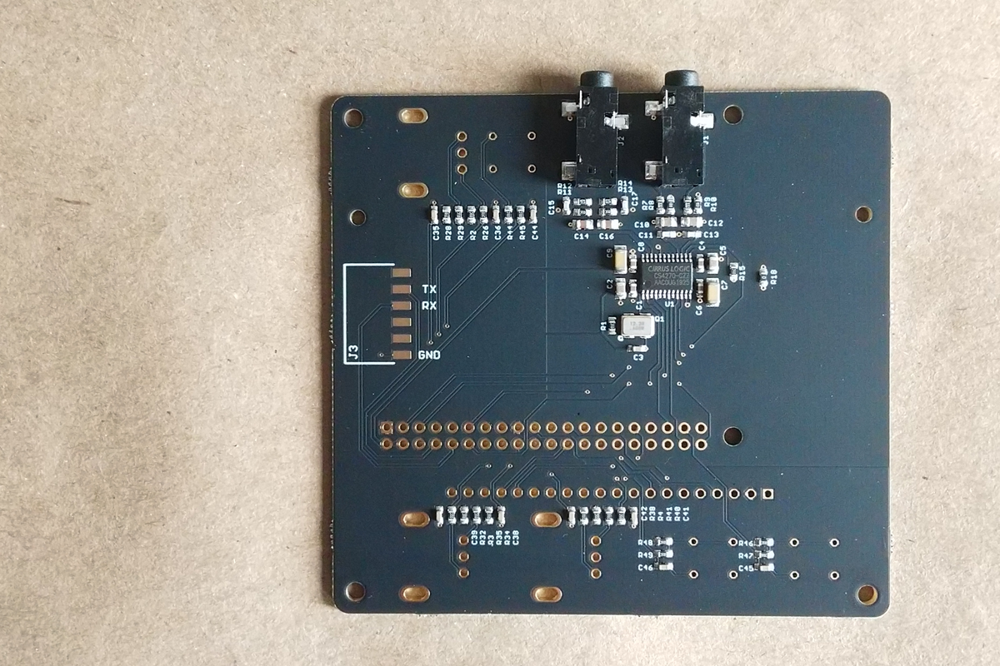

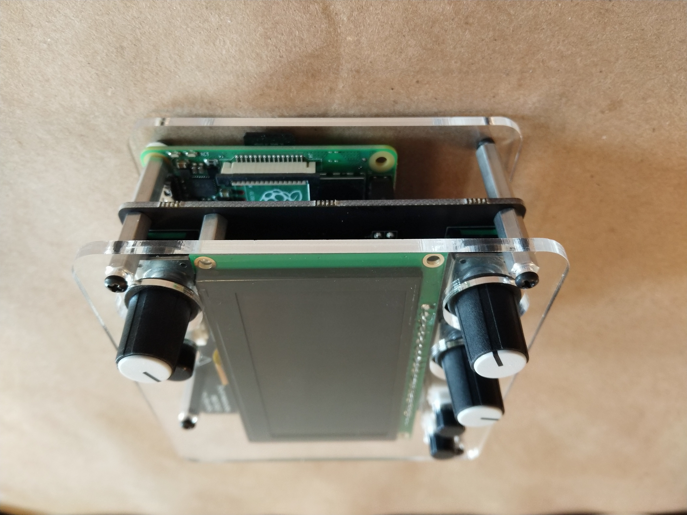

## assembly

for SMD-populated circuit.

parts shown (header already soldered to OLED)

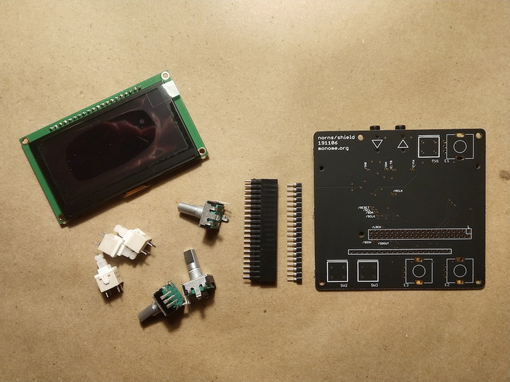

first solder the OLED header. then the encoders, and keys.

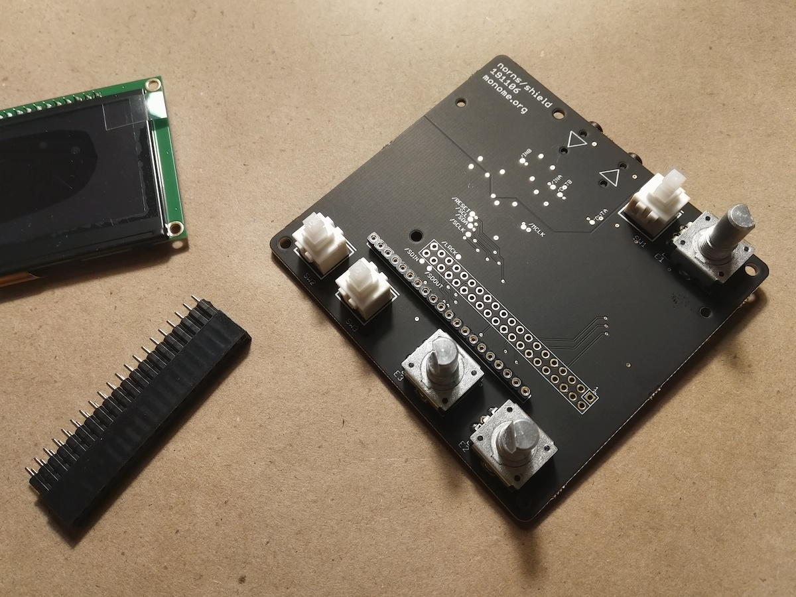

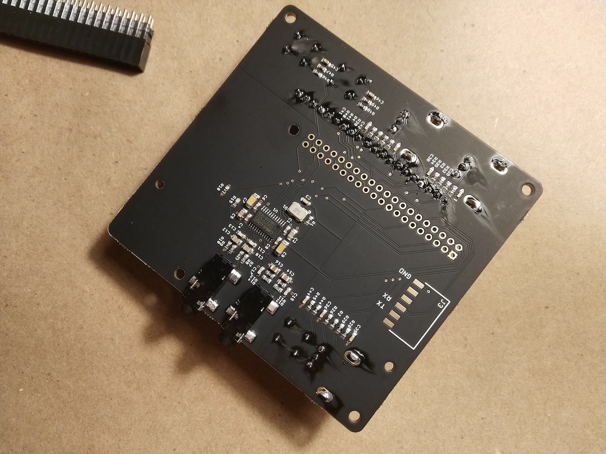

then attach the pi header to the other side and solder as shown.

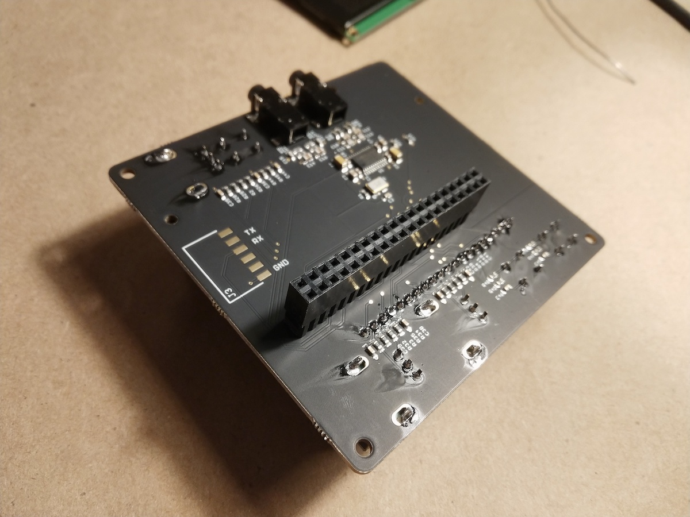

attach the screen to the top.

check the forum thread above for the newest disk image.

---

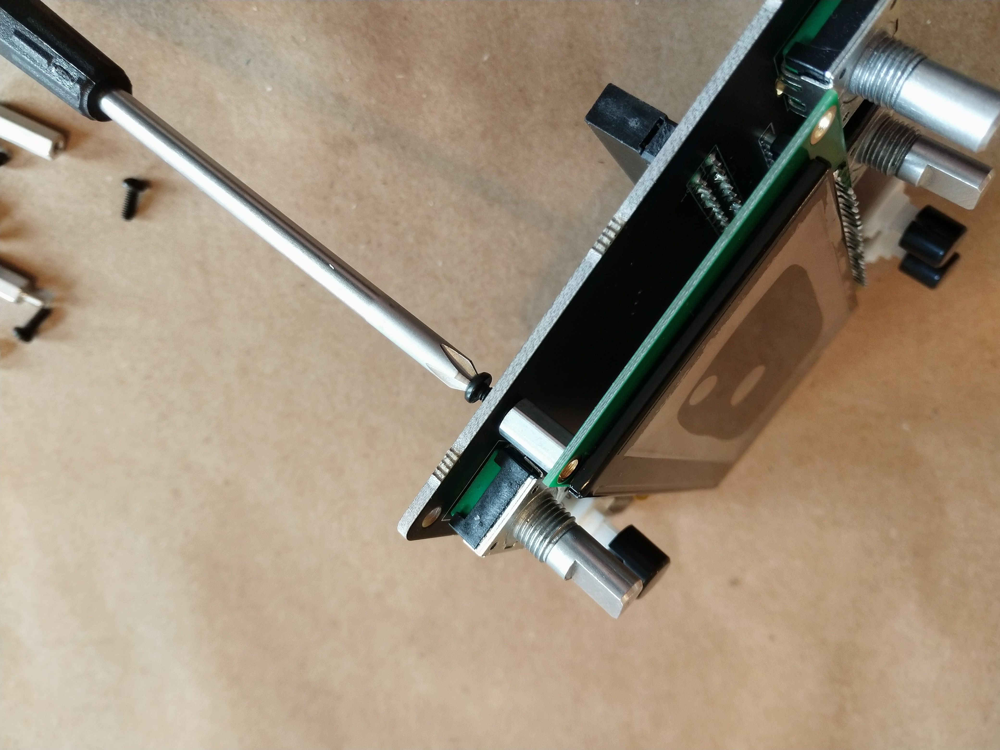

attach the shortest spacers with short screws, which props up the screen.

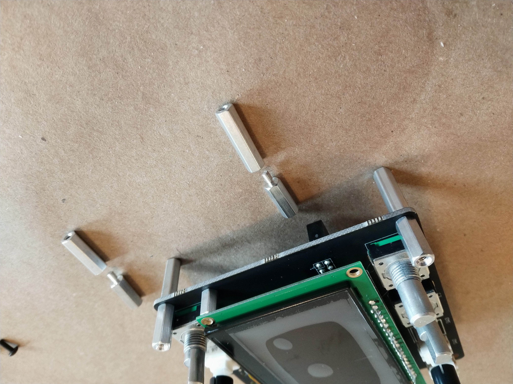

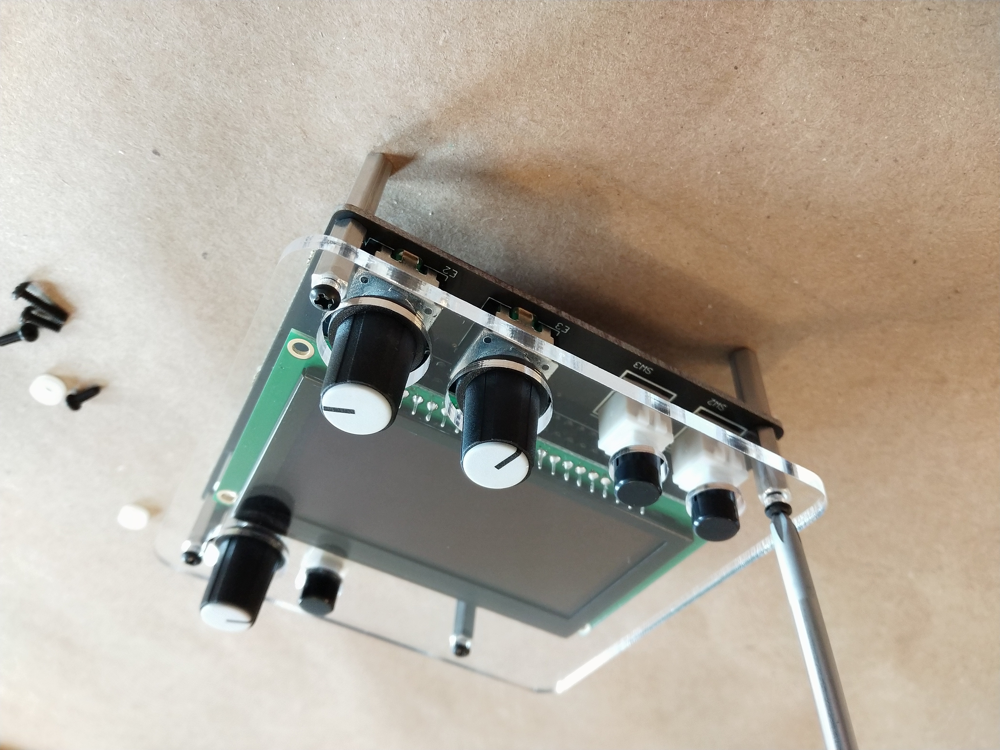

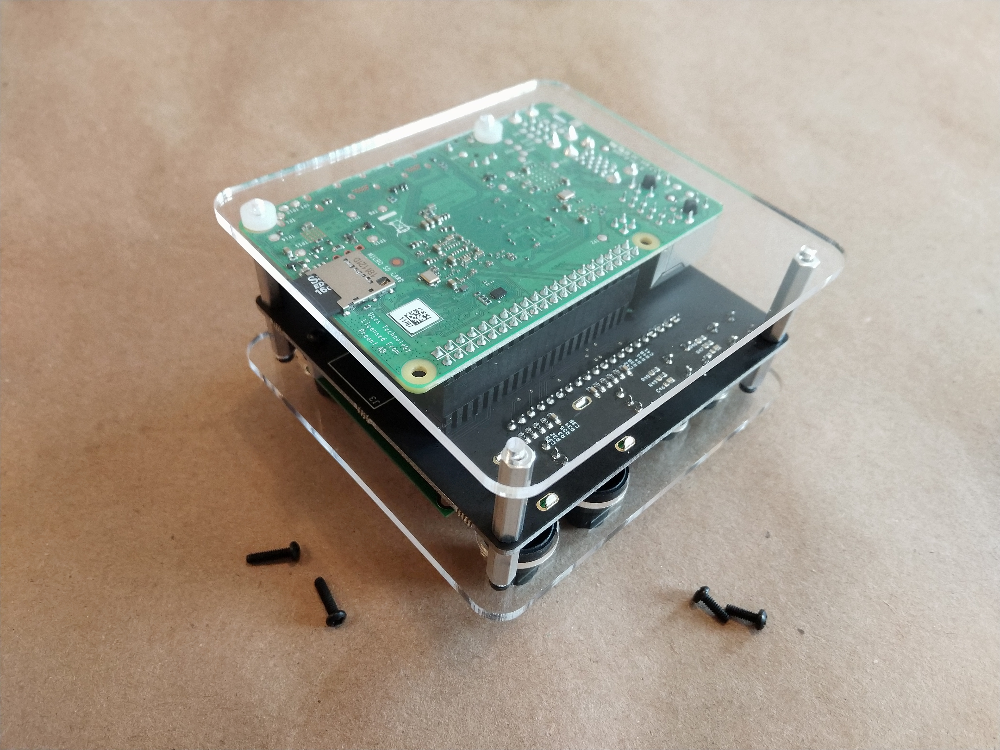

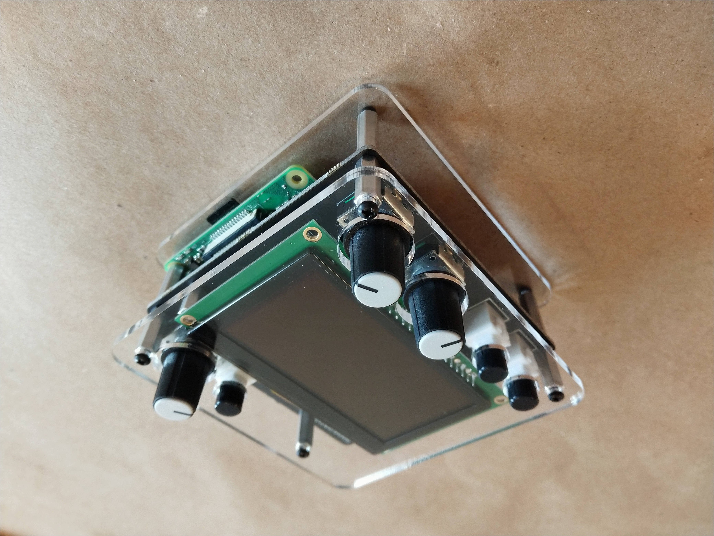

## troubleshooting

## notes

