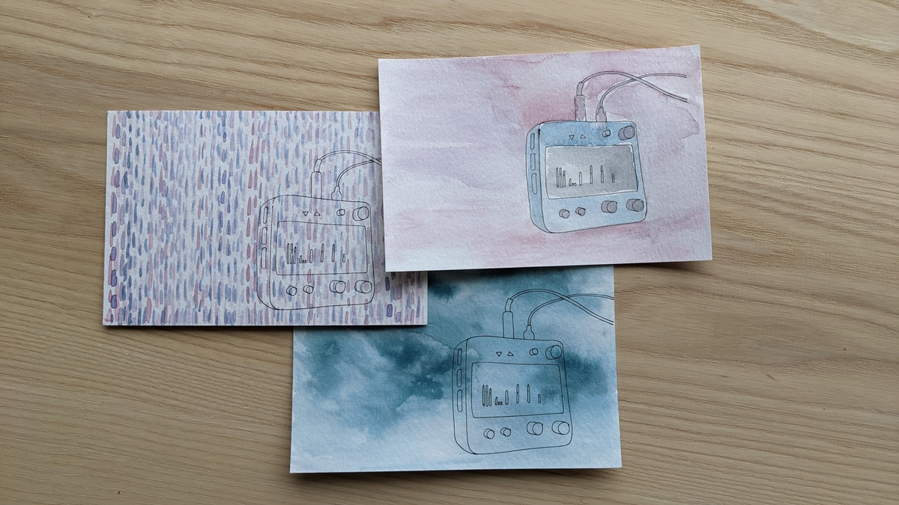

# norns-shield

minimal/tiny open-source/DIY shield for Raspberry Pi boards, providing hardware compatibility with the [norns](https://monome.org/docs/norns) ecosystem. designed by monome (brian crabtree, aka @tehn).

all discussion happens at [llllllll.co](https://llllllll.co/t/norns-shield-final/58810).

please be very aware that this project is no longer directly supported by [monome](https://monome.org). do not email us asking for build help or debugging. we also no longer sell boards or kits, we do not have leftovers laying around, and we do not provide repair services.

## donate

we've made these files freely available to further the exploration and design of new musical instruments. the shield relies on years of development, and we continue to maintain and evolve the platform. we hope you'll consider making a donation towards this effort.

order a hand-inked/painted robot-drawn [postcard](https://market.monome.org/products/shield-postcard) ($50) or direct donations accepted via [paypal](https://paypal.me/tehn/20).

## specifications

- audio codec: CS4270 (or CS4271 on v211028)
- audio jacks: 3.5mm stereo in/out, line level
- OLED: NHD-2.7-12864WDW3
- 3x pushbuttons, 3x rotary encoders

## versions

there are three versions of the circuit:

- 191106: original version
- 210330: updated with more robust (through hole) audio jacks, better noise isolation
- 211028: different codec (due to semiconductor shortages) which requires op amps and many many more passives

we _highly_ recommend 210330 if you're building a new board, and we suggest pairing it with a pi 3B+. the Pi 4 will work with all of the above, but the wifi transciever is noisier and the physical footprint does not fit as well because the ethernet and USB ports were moved around. 

all versions are provided here as reference for repairing existing boards.

## troubleshooting

- if using a Pi 4, you may need to cover the top metal of the USB and ethernet ports on the Pi 4 with electrical tape (something nonconductive) to prevent shorting if the assembly is squeezed tight.
- most soldering problems can be solved simply by reheating solder joints. bad solders can result in various problems: screen doesn't turn on, knobs/keys don't work.
- use a good SD card, not a cheap one. if you're having trouble, try using a different card.
- be sure to use the correct power supply. the pi will not power well from a laptop and you'll get confusing errors. get a dedicated 2A USB supply, or very high output USB battery.

## notes

- the shield does not have a headphone output, but headphones work fine on the main output. the headphone gain level within the norns menu does nothing in this case.
- the battery indication will not function, as there's no battery.

## mechanicals

- 2 Female Threaded Hex Standoff Aluminum, 3/16" Hex, 5/16" Long, 2-56 Thread 91780A104
- 2 Female Threaded Hex Standoff Aluminum, 3/16" Hex, 5/8" Long, 2-56 Thread 91780A111
- 2 Female Threaded Hex Standoff Aluminum, 3/16" Hex, 3/4" Long, 2-56 Thread 91780A113
- 4 Male-Female Threaded Hex Standoff Aluminum, 3/16" Hex Size, 1/2" Long, 2-56 Thread Size 93505A213
- 4 Off-White Nylon Unthreaded Spacer 1/4" OD, 3/32" Long, for Number 6 Screw Size 94639A247
- 8 Black-Oxide 18-8 Stainless Steel Pan Head Phillips Screws 2-56 Thread, 1/4" Long 91249A050
- 2 Black-Oxide 18-8 Stainless Steel Pan Head Phillips Screws 2-56 Thread, 3/8" Long 91249A054
